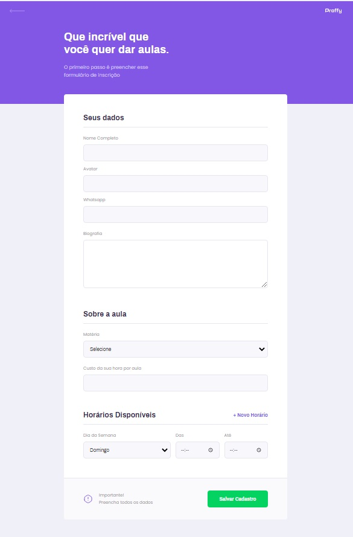
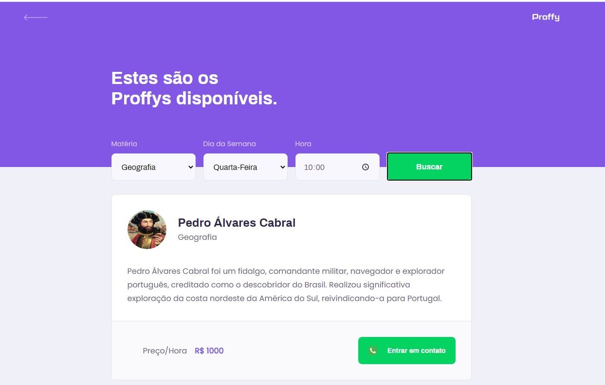

# NLW-rocketseat

# 

Projeto "Proffy", Next Level Week da [@Rocketseat](https://github.com/Rocketseat). (03/08 a 07/08) https://nextlevelweek.com/

<!-- #  -->

<!-- #  -->

FrontEnd Web da aplicação Proffy que se trata de uma plataforma para professores e alunos se conectarem. Para professores darem aula e para os alunos estudarem.

Produzido utilizando:

1. Create React App
2. TypeScript
3. Axios
4. react-router-dom 

### HomePage
# 

### Dar Aulas
# 

### Estudar
# 
